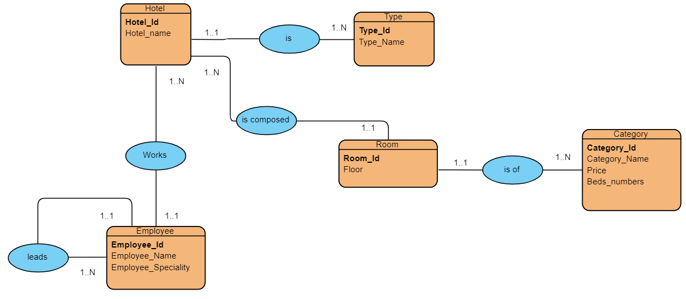
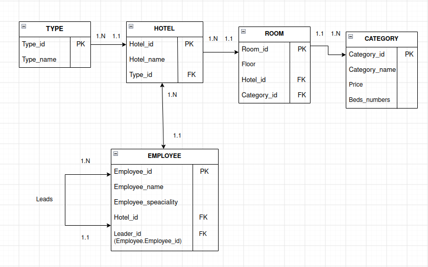

# Hotel Database — ER to Relational Model

This project converts the given Entity-Relationship (ER) model into a relational diagram.

## Original ER Model

## Relational Diagram

## Tables

The relational model contains the following tables:

- **TYPE** Type_Id, Type_Name
- **HOTEL** Hotel_Id, Hotel_Name, Type_Id
- **ROOM** Room_Id, Floor, Hotel_Id, Category_Id
- **CATEGORY** Category_Id, Category_Name, Price, Beds_numbers
- **EMPLOYEE** Employee_Id, Employee_Name, Employee_Speciality, Hotel_Id, Leader_Id

Primary keys and foreign keys are used to represent the relationships from the original ER model.
